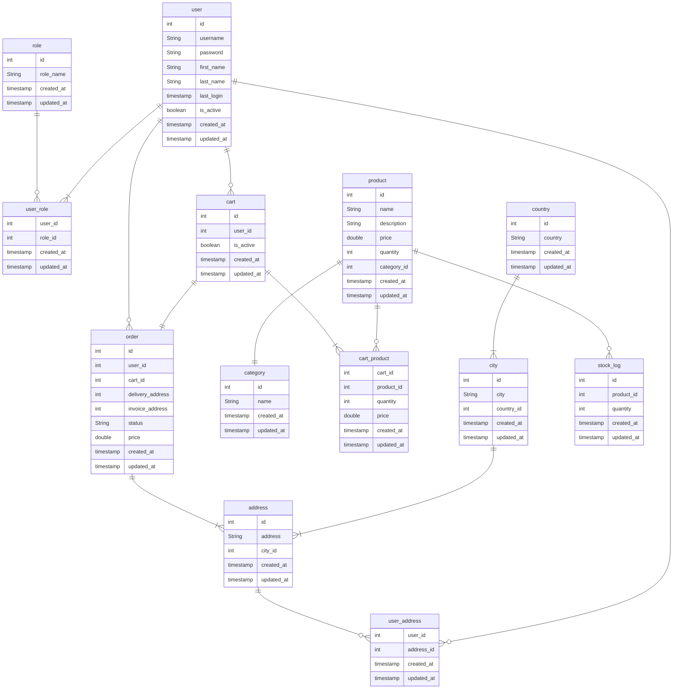

```mermaid
erDiagram
    user {
        int id
        String username
        String password
        String first_name
        String last_name
        timestamp last_login
        boolean is_active
        timestamp created_at
        timestamp updated_at
    }

    role {
        int id
        String role_name
        timestamp created_at
        timestamp updated_at
    }

    user_role {
        int user_id
        int role_id
        timestamp created_at
        timestamp updated_at
    }

    user_address {
        int user_id
        int address_id
        timestamp created_at
        timestamp updated_at
    }

    address {
        int id
        String address
        int city_id
        timestamp created_at
        timestamp updated_at
    }

    city {
        int id
        String city
        int country_id
        timestamp created_at
        timestamp updated_at
    }

    country {
        int id
        String country
        timestamp created_at
        timestamp updated_at
    }

    category{
        int id
        String name
        timestamp created_at
        timestamp updated_at
    }

    product {
        int id
        String name
        String description
        double price
        int quantity
        int category_id
        timestamp created_at
        timestamp updated_at
    }
    
    cart {
        int id
        int user_id
        boolean is_active
        timestamp created_at
        timestamp updated_at
    }

    cart_product {
        int cart_id
        int product_id
        int quantity
        double price
        timestamp created_at
        timestamp updated_at
    }

    order {
        int id
        int user_id
        int cart_id
        int delivery_address
        int invoice_address
        String status
        double price
        timestamp created_at
        timestamp updated_at
    }
    
    stock_log {
        int id
        int product_id
        int quantity
        timestamp created_at
        timestamp updated_at
    }

    user ||--|{ user_role: ""
    role ||--o{ user_role: ""
    user ||--o{ user_address: ""
    user ||--o{ cart: ""

    address ||--o{ user_address: ""
    city ||--|{ address: ""
    country ||--|{ city: ""

    product ||--|| category: ""
    product ||--o{ cart_product: ""
    product ||--o{ stock_log: ""
    
    cart ||--|{ cart_product: ""
    cart ||--|| order: ""

    order ||--|{ address: ""
    user ||--o{ order: ""
```