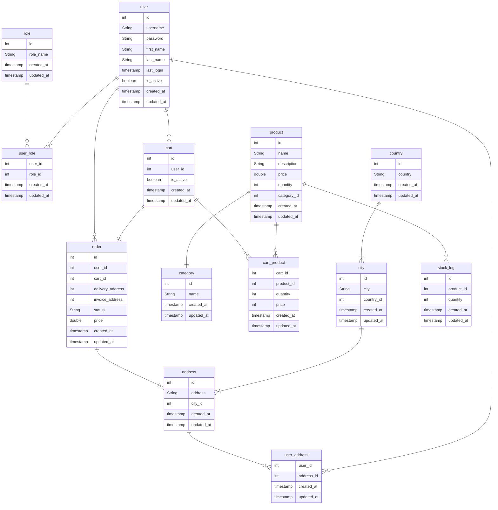

## Relationships
- A user can have one or more roles. A role can be assigned to 0 or more users
- A user can have 0 or more addresses. An address can belong to 0 or more users
- A user can have 0 or more carts ( not at the same time )
- A city can have 1 or more addresses
- A country can have 1 or more cities
- A product can have 1 category
- A product can have 0 or more stock_logs 
- A cart can have one or more products. A product can be assigned to 0 or more carts
- A user can have 0 or more orders.

## Constraints notes
- Users: username = unique
- Category: name = not null and unique
- Cart: is_active default is true
- To ensure one active cart at all time: a unique partial index on user_id, is_active where is_active is true
- Trigger before insert on user_address => if 5 addresses for user then rollback 
- Trigger before update for each entity => set updated_at to current_timestamp
- User deletion prevention
  - A procedure fo delete_user where is_active will be set to 0
  - Multi role access: a postgres role can delete, the other can not
- To ensure older price in the order history, the column price in cart_product represents the price of the product at the time of the order

## Potential indexes
- Foreign keys
- Order -> created_at
- Product -> name