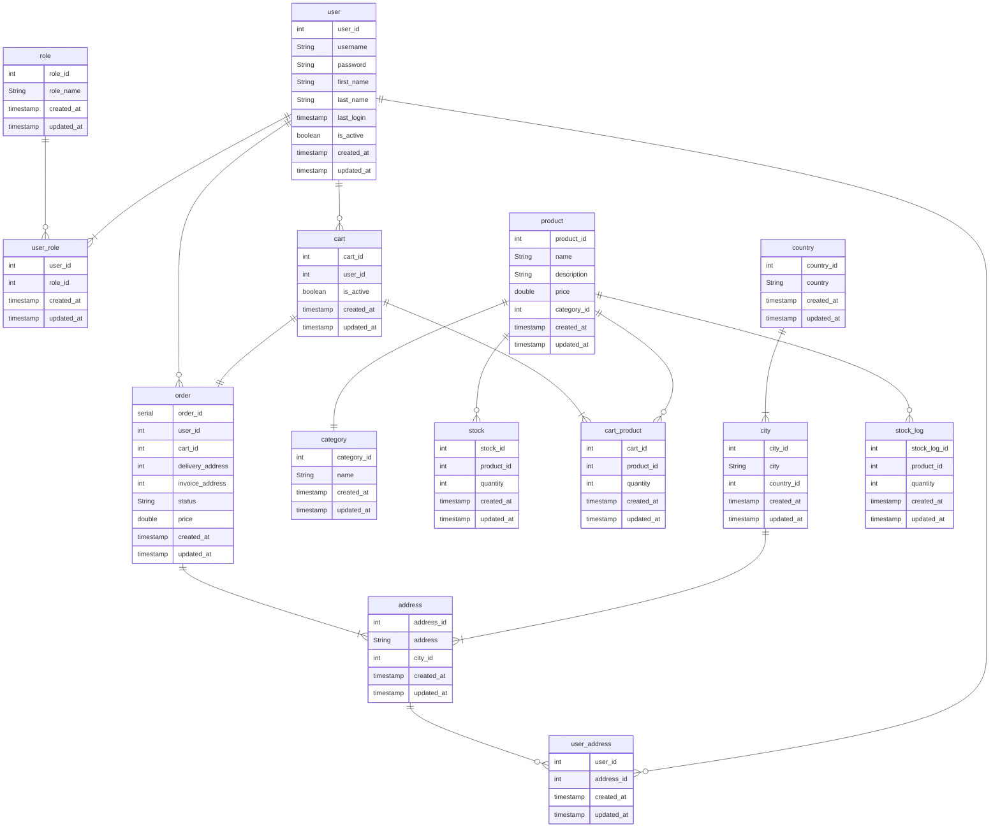

## Relationships
- A user can have one or more roles. A role can be assigned to 0 or more users
- A user can have 0 or more addresses. An address can belong to 0 or more users
- A user can have 0 or more carts ( not at the same time )
- A city can have 1 or more addresses
- A country can have 1 or more cities
- A product can have 1 category
- A product can have 0 or more stock_logs 
- A cart can have one or more products. A product can be assigned to 0 or more carts
- A user can have 0 or more orders.

## Constraints notes
- Users: username = unique
- Category: name = not null and unique
- Cart: is_active default is true
- To ensure one active cart at all time:
  - Option1: a unique partial index on user_id where is_active = true
  - Option2: an exclude constraint on user_id where is_active = true 
  - Option3: a trigger
- Trigger before insert on user_address => if 5 addresses for user then rollback 
- Trigger before update for each entity => set updated_at to current_timestamp
- Trigger before delete for users:
  - Option1: just raise an exception => all "deletes" must be done using update users set is_active = 0
  - Option2: update in the trigger and return null
- Product: fk(category_id) on update cascade on delete set null (maybe)

## Potential indexes
- Order -> created_at
- Product -> name (maybe)